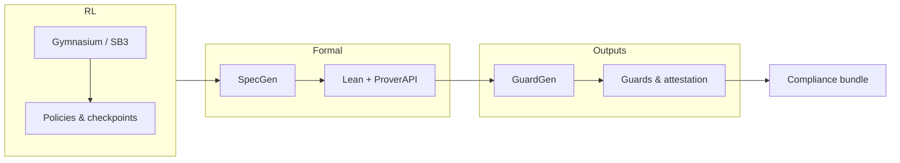

# SafeRL ProofStack

[](LICENSE)
[](https://www.python.org/downloads/)
[](https://github.com/fraware/saferl-proof-stack)

**ProofStack** turns reinforcement-learning setups into a repeatable pipeline: you describe safety properties in a structured form, generate **Lean** artifacts, call a **remote prover** where needed, emit **runtime guard code**, and assemble **compliance-oriented bundles** (reports, SBOM, attestation outputs).

| | |
| :--- | :--- |
| **PyPI name** | `proofstack` |
| **Import** | `import proofstack` / `from proofstack.specgen import SpecGen` |
| **CLI** | `proofstack` |

---

## Capabilities

| Layer | What you get |
| :--- | :--- |
| **Specification** | Invariants, guards, and lemmas expressed for Lean generation (`SpecGen`). |
| **Formal core** | Lean files and proof steps wired through `ProverAPI` (Fireworks / DeepSeek-Prover). |
| **Runtime** | C guard codegen from the same spec surface (`GuardGen`). |
| **Delivery** | Attestation and compliance mapping bundled for review and tooling. |

---

## Install

**From a checkout** (typical for development):

```bash
git clone https://github.com/fraware/saferl-proof-stack.git
cd saferl-proof-stack
pip install -e .
```

**Direct install** from the repo root:

```bash
pip install .
```

Requires **Python 3.9+**. Optional: [Poetry](https://python-poetry.org/) for lockfile-driven workflows.

---

## Minimal example (library)

Generate a Lean spec from Python constraints:

```python
from proofstack.specgen import SpecGen

spec = SpecGen()
spec.invariants = ["|σ.cart_position| ≤ 2.4", "|σ.pole_angle| ≤ 0.2095"]
spec.guard = ["|σ.cart_position| ≤ 2.3", "|σ.pole_angle| ≤ 0.2", "|a.force| ≤ 10.0"]
spec.lemmas = ["position_step_bound"]

lean_file = spec.emit_lean(algorithm_name="ppo")
print(lean_file)
```

---

## CLI quick start

`proofstack bundle` talks to the **Fireworks** API. Export a key first:

```bash
export FIREWORKS_API_KEY="your_key"   # Windows: set FIREWORKS_API_KEY=your_key
```

Then:

```bash
proofstack init cartpole
proofstack train --algo ppo --timesteps 10000
proofstack bundle --algo ppo
```

---

## CLI reference

| Command | Purpose |
| :--- | :--- |
| `proofstack init <env>` | Scaffold `env.py`, `safety_spec.yaml`, and `rl/`, `specs/`, `dist/`. Use `--output` / `-o` for the project directory (default: `./my_env`). |
| `proofstack train` | Train with Stable-Baselines3. Options: `--algo`, `--timesteps`, `--env`, `--wandb`, `--output`. |
| `proofstack bundle` | Full bundle (proofs, guards, attestation). Options: `--spec`, `--output`, `--watch`, `--algo`, `--reuse-cache` / `--no-reuse-cache`. **Requires `FIREWORKS_API_KEY`.** |
| `proofstack version` | Print version information. |

---

## Architecture



At a glance: training feeds specifications; **SpecGen** and **ProverAPI** produce Lean proofs; **GuardGen** and **Attestation** produce guards and bundle artifacts.

---

## End-to-end snippet (pipeline)

```python
import os

import gymnasium as gym
from proofstack import ProofPipeline, SpecGen

env = gym.make("CartPole-v1")
spec = SpecGen()
spec.invariants = ["|σ.cart_position| ≤ 2.4", "|σ.pole_angle| ≤ 0.2095"]
spec.guard = ["|σ.cart_position| ≤ 2.3", "|σ.pole_angle| ≤ 0.2"]

spec.emit_lean(algorithm_name="ppo")
spec.write_proof("simp [h_guard]")

api_key = os.environ["FIREWORKS_API_KEY"]
pipeline = ProofPipeline(env, spec, api_key)
bundle = pipeline.run()
```

Use your own `gym.Env` once it matches the observation semantics assumed by your spec.

---

## Lean (optional)

If you use the bundled Lake project:

```bash
lake build
```

First run may fetch **mathlib** and take considerable time.

---

## Test and smoke checks

```bash
pytest tests/ -v --cov=proofstack
python run_tests.py    # optional wrapper with project defaults
```

CLI smoke (training is local; bundle needs `FIREWORKS_API_KEY`):

```bash
proofstack init cartpole
proofstack train --algo ppo --timesteps 100
proofstack bundle --algo ppo
```

---

## Documentation

| Doc | Content |
| :--- | :--- |
| [docs/api_reference.md](docs/api_reference.md) | Classes, CLI, environment variables |
| [docs/architecture.md](docs/architecture.md) | Components and data flow |
| [docs/compliance.md](docs/compliance.md) | Compliance mapping overview |
| [docs/index.md](docs/index.md) | MkDocs home (`poetry run mkdocs serve` after `poetry install`) |

---

## Contributing

See [CONTRIBUTING.md](CONTRIBUTING.md). With Poetry (recommended for this repo):

```bash
poetry install
pre-commit install
pytest tests/ -v --cov=proofstack
```

Preview the documentation site:

```bash
poetry run mkdocs serve
```

Fork, branch, commit, push, and open a PR against [fraware/saferl-proof-stack](https://github.com/fraware/saferl-proof-stack).

---

## License

Released under the [MIT License](LICENSE).

---

## Acknowledgments

- [Lean 4](https://leanprover.github.io/) — theorem proving
- [Stable-Baselines3](https://stable-baselines3.readthedocs.io/) — RL algorithms
- [Fireworks AI](https://fireworks.ai/) — hosted prover API
- [Gymnasium](https://gymnasium.farama.org/) — environments

---

## Support

- [Issues](https://github.com/fraware/saferl-proof-stack/issues)
- [Discussions](https://github.com/fraware/saferl-proof-stack/discussions)
