# System Architecture

## Overview

SafeRL ProofStack is designed as a modular system that transforms RL environments into formally verified safety proofs and compliance artifacts. The architecture follows a pipeline pattern with clear separation of concerns.

## High-Level Architecture


## Component Architecture

### Core Components


### Data Flow


## Detailed Component Design

### ProofPipeline

The main orchestrator that coordinates all components:

```python
class ProofPipeline:
    def __init__(self, env, spec, api_key):
        self.env = env
        self.spec = spec
        self.prover = ProverAPI(api_key)
        self.guardgen = GuardGen()
        self.attestation = Attestation()

    def run(self) -> Bundle:
        # 1. Generate Lean specification
        lean_file = self.spec.emit_lean()

        # 2. Generate proof
        proof = self.prover.complete(lean_file)
        self.spec.write_proof(proof)

        # 3. Generate guard code
        guard_file = self.guardgen.emit_c(self.spec)

        # 4. Create compliance bundle
        bundle = self.attestation.bundle(self.spec, self.guardgen)
        return bundle
```

### SpecGen

Converts Python safety specifications to Lean4 code:


### ProverAPI

Integrates with Fireworks DeepSeek-Prover for proof completion:


### GuardGen

Generates runtime safety guards in C/C++:


### Attestation

Creates comprehensive compliance artifacts:


## Multi-Algorithm Support

### Algorithm Adapter Pattern


### Algorithm-Specific Lean Templates

Each algorithm has its own Lean4 template that references the appropriate policy:

```lean
-- PPO Template
theorem safe_ppo_policy : ∀ σ, invariant σ → safe_action (ppo_policy σ)

-- SAC Template
theorem safe_sac_policy : ∀ σ, invariant σ → safe_action (sac_policy σ)

-- DDPG Template
theorem safe_ddpg_policy : ∀ σ, invariant σ → safe_action (ddpg_policy σ)
```

## CLI Architecture

### Command Structure


### Async Streaming Architecture

```mermaid
sequenceDiagram
    participant User
    participant CLI
    participant ProverAPI
    participant Fireworks

    User->>CLI: proofstack bundle --watch
    CLI->>ProverAPI: stream(lean_file)
    ProverAPI->>Fireworks: POST /chat/completions
    Fireworks-->>ProverAPI: SSE stream
    loop Stream Processing
        ProverAPI-->>CLI: "🤖 Analyzing..."
        CLI-->>User: Progress update
    end
    ProverAPI-->>CLI: "✅ Complete"
    CLI-->>User: Success
```



## REST API Architecture

### API Endpoints

```mermaid
graph LR
    A[FastAPI Server] --> B[/init]
    A --> C[/train]
    A --> D[/bundle]
    A --> E[/spec]
    A --> F[/bundle/{id}]

    B --> G[Project Creation]
    C --> H[RL Training]
    D --> I[Proof Generation]
    E --> J[Spec Management]
    F --> K[Artifact Download]

    style A fill:#e3f2fd
    style I fill:#e8f5e8
```

### Request/Response Flow


## Security Architecture

### API Key Management


### Artifact Integrity


## Deployment Architecture

### CI/CD Pipeline


### Docker Architecture


## Performance Considerations

### Caching Strategy


### Scalability

- **Horizontal scaling** via REST API
- **Async processing** for proof generation
- **Caching** for repeated specifications
- **Mock mode** for offline development

## Future Architecture

### Planned Enhancements


This architecture provides a solid foundation for safe, scalable, and maintainable RL safety proofs with formal verification.
