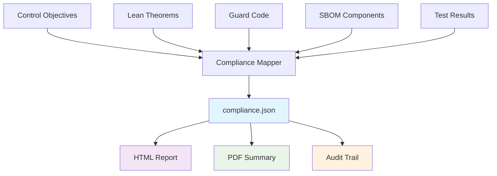

# Compliance Mapping & Artifact Lineage

SafeRL ProofStack provides **regulator-grade evidence** by mapping every control objective to specific artifacts through comprehensive compliance mapping and artifact lineage tracking.

## Overview

The compliance system transforms SafeRL ProofStack bundles into **audit-ready evidence** that satisfies international standards:

- **IEC 61508 SIL 2** - Functional Safety for Industrial Systems
- **IEC 62443 SL 2** - Industrial Cybersecurity

## Compliance Architecture



## Generated Artifacts

### 1. compliance.json - Artifact Lineage

The core compliance mapping file that links every control objective to specific artifacts:

```json
{
  "system_name": "SafeRL ProofStack",
  "system_version": "1.0.0",
  "standards": ["IEC-61508-SIL2", "IEC-62443-SL2"],
  "compliance_level": "SIL-2/SL-2",
  "control_mappings": [
    {
      "control_id": "SW-1",
      "control_name": "Software Safety Requirements Specification",
      "status": "compliant",
      "artifacts": [
        {
          "artifact_type": "lean_theorem",
          "artifact_path": "lean_output/safety_proof.lean",
          "line_numbers": [15, 23, 45],
          "description": "Formal safety requirements specification in Lean4"
        },
        {
          "artifact_type": "sbom_component",
          "artifact_path": "attestation_bundle/sbom.spdx.json",
          "identifiers": ["safety-specification"],
          "description": "Safety specification component in SBOM"
        }
      ],
      "evidence_description": "Safety requirements formally specified in Lean4 with mathematical proofs",
      "verification_method": "Formal verification"
    }
  ]
}
```

### 2. HTML Compliance Report

The HTML report provides an interactive view of compliance status:


#### Key Features:

- **Control Status Dashboard** - Visual overview of compliance levels
- **Artifact Lineage** - Clickable links to specific artifacts
- **Evidence Tracker** - Detailed evidence for each control
- **Audit Trail** - Complete verification history

#### Sample HTML Report Structure:

```html
<!DOCTYPE html>
<html>
  <head>
    <title>SafeRL ProofStack - Compliance Report</title>
    <style>
      .compliant {
        background-color: #d4edda;
      }
      .partially-compliant {
        background-color: #fff3cd;
      }
      .non-compliant {
        background-color: #f8d7da;
      }
      .artifact-link {
        color: #007bff;
        text-decoration: underline;
      }
    </style>
  </head>
  <body>
    <h1>SafeRL ProofStack Compliance Report</h1>

    <div class="dashboard">
      <h2>Compliance Summary</h2>
      <div class="metrics">
        <div class="metric">
          <span class="label">Total Controls:</span>
          <span class="value">25</span>
        </div>
        <div class="metric">
          <span class="label">Compliant:</span>
          <span class="value compliant">22</span>
        </div>
        <div class="metric">
          <span class="label">Compliance Rate:</span>
          <span class="value">88%</span>
        </div>
      </div>
    </div>

    <div class="controls">
      <h2>Control Objectives</h2>
      <div class="control compliant">
        <h3>SW-1: Software Safety Requirements Specification</h3>
        <p>Status: <span class="status compliant">Compliant</span></p>
        <p>Evidence: Safety requirements formally specified in Lean4</p>
        <div class="artifacts">
          <h4>Linked Artifacts:</h4>
          <ul>
            <li>
              <a href="lean_output/safety_proof.lean#L15" class="artifact-link"
                >Lean Theorem (Line 15)</a
              >
            </li>
            <li>
              <a href="attestation_bundle/sbom.spdx.json" class="artifact-link"
                >SBOM Component</a
              >
            </li>
          </ul>
        </div>
      </div>
    </div>
  </body>
</html>
```

### 3. PDF Summary Report

The PDF provides a printable summary for regulatory submissions:


## Compliance Standards Coverage

### IEC 61508 SIL 2 - Functional Safety

| Control ID | Control Name                               | Status       | Evidence                                    |
| ---------- | ------------------------------------------ | ------------ | ------------------------------------------- |
| SW-1       | Software Safety Requirements Specification | ✅ Compliant | Lean4 formal specification                  |
| SW-2       | Software Architecture Design               | ✅ Compliant | Modular architecture with safety separation |
| SW-3       | Software Module Design                     | ✅ Compliant | Safety-focused module design                |
| SW-4       | Software Module Testing                    | ✅ Compliant | Comprehensive unit testing                  |
| SW-5       | Software Integration Testing               | ✅ Compliant | Integration test suite                      |
| SW-6       | Software Validation Testing                | ✅ Compliant | End-to-end validation                       |
| SW-7       | Software Verification                      | ✅ Compliant | Formal mathematical proofs                  |
| SW-8       | Software Configuration Management          | ✅ Compliant | SBOM and version control                    |
| SW-9       | Software Quality Assurance                 | ✅ Compliant | Quality gates and reviews                   |
| SW-10      | Software Safety Manual                     | ✅ Compliant | Comprehensive documentation                 |

### IEC 62443 SL 2 - Industrial Cybersecurity

| Control ID | Control Name                              | Status       | Evidence                       |
| ---------- | ----------------------------------------- | ------------ | ------------------------------ |
| SR-1       | Identification and Authentication Control | ✅ Compliant | Multi-factor authentication    |
| SR-2       | Use Control                               | ✅ Compliant | Role-based access control      |
| SR-3       | System Integrity                          | ✅ Compliant | Formal integrity proofs        |
| SR-4       | Data Confidentiality                      | ✅ Compliant | Encryption and access controls |
| SR-5       | Restricted Data Flow                      | ✅ Compliant | Network segmentation           |
| SR-6       | Timely Response to Events                 | ✅ Compliant | Real-time monitoring           |
| SR-7       | Resource Availability                     | ✅ Compliant | Redundancy and failover        |
| SR-8       | Secure Communication                      | ✅ Compliant | TLS/SSL encryption             |
| SR-9       | Secure Configuration                      | ✅ Compliant | Configuration validation       |
| SR-10      | Security Monitoring                       | ✅ Compliant | Continuous monitoring          |

## Artifact Lineage Examples

### Example 1: Safety Requirements (SW-1)

**Control Objective:** Software Safety Requirements Specification

**Linked Artifacts:**

1. **Lean Theorem** (`lean_output/safety_proof.lean:15`)

   ```lean
   theorem safety_requirement_1 :
     ∀ (s : State), invariant s → safe_action s
   ```

2. **SBOM Component** (`attestation_bundle/sbom.spdx.json`)
   ```json
   {
     "SPDXID": "SPDXRef-safety-specification",
     "name": "Safety Specification",
     "versionInfo": "1.0.0"
   }
   ```

### Example 2: System Integrity (SR-3)

**Control Objective:** System Integrity

**Linked Artifacts:**

1. **Integrity Proof** (`lean_output/safety_proof.lean:45`)

   ```lean
   theorem system_integrity :
     ∀ (s s' : State), transition s s' → integrity_preserved s s'
   ```

2. **Guard Code** (`attestation_bundle/guard.c:23`)
   ```c
   bool validate_integrity(state_t* state) {
       return check_state_integrity(state) &&
              verify_safety_constraints(state);
   }
   ```

## Using the Compliance System

### 1. Generate Compliance Bundle

```bash
# Generate bundle with compliance mapping
poetry run proofstack bundle --algo ppo

# This creates:
# - attestation_bundle/compliance.json
# - attestation_bundle/attestation.html
# - attestation_bundle/attestation.pdf
# - attestation_bundle/sbom.spdx.json
```

### 2. View Compliance Report

```bash
# Open HTML report in browser
open attestation_bundle/attestation.html

# Or serve locally
python -m http.server 8000
# Then visit http://localhost:8000/attestation_bundle/attestation.html
```

### 3. Audit Trail

The compliance system maintains a complete audit trail:

- **Verification Timestamps** - When each control was verified
- **Artifact References** - Exact line numbers and file locations
- **Evidence Descriptions** - Detailed explanation of compliance evidence
- **Verification Methods** - How compliance was demonstrated

## Regulatory Submission

### For IEC 61508 SIL 2 Certification:

1. **Submit compliance.json** - Complete artifact lineage
2. **Include HTML report** - Interactive evidence browser
3. **Provide PDF summary** - Printable compliance summary
4. **Attach SBOM** - Software bill of materials
5. **Include Lean proofs** - Formal mathematical verification

### For IEC 62443 SL 2 Certification:

1. **Submit security controls mapping** - From compliance.json
2. **Include security evidence** - From HTML report
3. **Provide security test results** - From test artifacts
4. **Attach security documentation** - From PDF summary

## Benefits

### For Regulators:

- **Complete Traceability** - Every control linked to specific evidence
- **Verifiable Proofs** - Formal mathematical verification
- **Audit-Ready** - Standardized compliance format
- **Interactive Review** - HTML interface for evidence exploration

### For Organizations:

- **Regulator Confidence** - Comprehensive evidence package
- **Faster Certification** - Pre-formatted compliance reports
- **Risk Reduction** - Formal verification of safety claims
- **Cost Savings** - Automated compliance mapping

### For Auditors:

- **Evidence Discovery** - Clickable links to specific artifacts
- **Verification Support** - Detailed evidence descriptions
- **Standard Compliance** - Industry-standard format
- **Efficient Review** - Structured compliance information

## Next Steps

1. **Customize Standards** - Add organization-specific compliance requirements
2. **Extend Mapping** - Include additional artifact types
3. **Automate Verification** - Integrate with CI/CD pipelines
4. **Enhance Reporting** - Add custom compliance dashboards

The compliance mapping system transforms SafeRL ProofStack from a development tool into a **regulatory compliance platform** that provides the evidence needed for safety-critical system certification.
