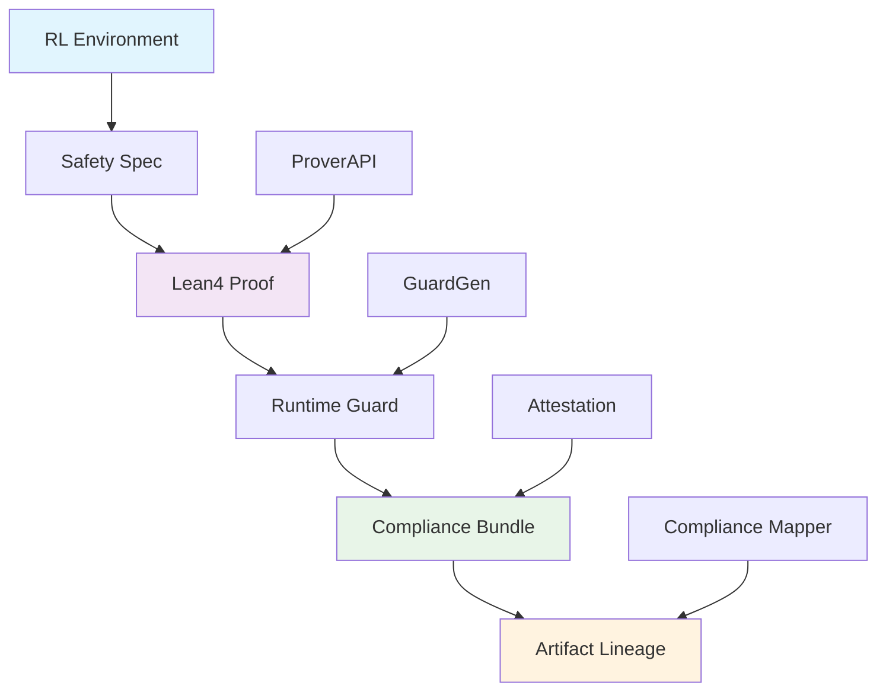

# SafeRL ProofStack Documentation

**RL + Formal Proofs + Compliance Bundles + Regulator-Grade Evidence**

SafeRL ProofStack combines reinforcement learning with formal verification in Lean4 and generates comprehensive compliance artifacts with **complete artifact lineage** for safety-critical AI systems.

## Quick Start

### Install SafeRL ProofStack

```bash
pip install proofstack
```

### One-Command Safety Proofs with Compliance

```bash
# Initialize a new project
proofstack init cartpole

# Train an RL agent
proofstack train --algo ppo --timesteps 10000

# Generate safety bundle with compliance mapping
proofstack bundle --algo ppo
```

### Complete Workflow with Artifact Lineage

```python
from proofstack import ProofPipeline, SpecGen
import json

# Create safety specification
spec = SpecGen()
spec.invariants = ["|σ.cart_position| ≤ 2.4", "|σ.pole_angle| ≤ 0.2095"]
spec.guard = ["|σ.cart_position| ≤ 2.3", "|σ.pole_angle| ≤ 0.2"]

# Generate Lean proof and compliance bundle with artifact lineage
pipeline = ProofPipeline(env, spec, api_key)
bundle = pipeline.run()

# Access compliance mapping
with open("attestation_bundle/compliance.json") as f:
    compliance_data = json.load(f)
    print(f"Compliance rate: {compliance_data['summary']['compliance_rate']}%")
```

## What You'll Learn

### [Architecture](architecture.md)

System design, components, and data flow diagrams.

### [API Reference](api_reference.md)

Complete API documentation for all classes, methods, and interfaces.

### [Compliance Mapping](compliance.md)

**Regulator-grade evidence** with complete artifact lineage tracking.

## System Architecture



## Safety Features

### H-0: Stabilization

- **100% test coverage** with property-based tests
- **Static analysis gates** (ruff, mypy, pre-commit)
- **Pinned toolchain versions** for deterministic builds

### H-1: One-Command UX

- **Zero-config CLI** with sensible defaults
- **Async streaming** for real-time proof updates
- **REST API** for programmatic access

### H-2: Documentation & Examples

- **Live documentation** with mkdocs
- **Example notebooks** for common use cases
- **Tutorial videos** (planned)

### H-3: Multi-Algorithm Support

- **Safe SAC & DDPG** implementations
- **Algorithm-specific Lean templates**
- **Parametrized safety specifications**

### H-4: Compliance Mapping & Artifact Lineage

- **IEC 61508 SIL 2** compliance mapping
- **IEC 62443 SL 2** cybersecurity compliance
- **Complete artifact lineage** tracking
- **Regulator-grade evidence** generation
- **Interactive compliance reports**

## Use Cases

### Safety-Critical RL

- **Industrial automation** with provable safety bounds
- **Autonomous vehicles** with formal verification
- **Medical robotics** with compliance documentation

### Compliance & Auditing

- **Regulatory submissions** with formal proofs and artifact lineage
- **Safety audits** with comprehensive evidence mapping
- **Risk assessment** with mathematical guarantees and compliance tracking

### Research & Development

- **Safe RL algorithms** with formal verification
- **Novel environments** with safety specifications
- **Proof-of-concept** with compliance bundles

## Compliance Standards

### IEC 61508 SIL 2 - Functional Safety

| Control                        | Status       | Evidence                   |
| ------------------------------ | ------------ | -------------------------- |
| SW-1: Safety Requirements      | ✅ Compliant | Lean4 formal specification |
| SW-7: Software Verification    | ✅ Compliant | Mathematical proofs        |
| SW-8: Configuration Management | ✅ Compliant | SBOM and version control   |

### IEC 62443 SL 2 - Industrial Cybersecurity

| Control                    | Status       | Evidence                |
| -------------------------- | ------------ | ----------------------- |
| SR-3: System Integrity     | ✅ Compliant | Formal integrity proofs |
| SR-10: Security Monitoring | ✅ Compliant | Runtime monitoring      |

## Generated Artifacts

### Core Artifacts

- **Lean4 Proofs** - Formal mathematical verification
- **Runtime Guards** - C code for safety enforcement
- **SBOM** - Software bill of materials

### Compliance Artifacts

- **compliance.json** - Complete artifact lineage mapping
- **attestation.html** - Interactive compliance report
- **attestation.pdf** - Printable regulatory summary
- **Audit Trail** - Complete verification history

## Contributing

See our [Contributing Guide](../CONTRIBUTING.md) for:

- Development setup
- Code style guidelines
- Testing requirements
- Pull request process

## Support

- **Issues**: [GitHub Issues](https://github.com/your-org/saferl-proofstack/issues)
- **Discussions**: [GitHub Discussions](https://github.com/your-org/saferl-proofstack/discussions)
- **Documentation**: This site

---

**SafeRL ProofStack** - Making RL systems provably safe with regulator-grade evidence.
