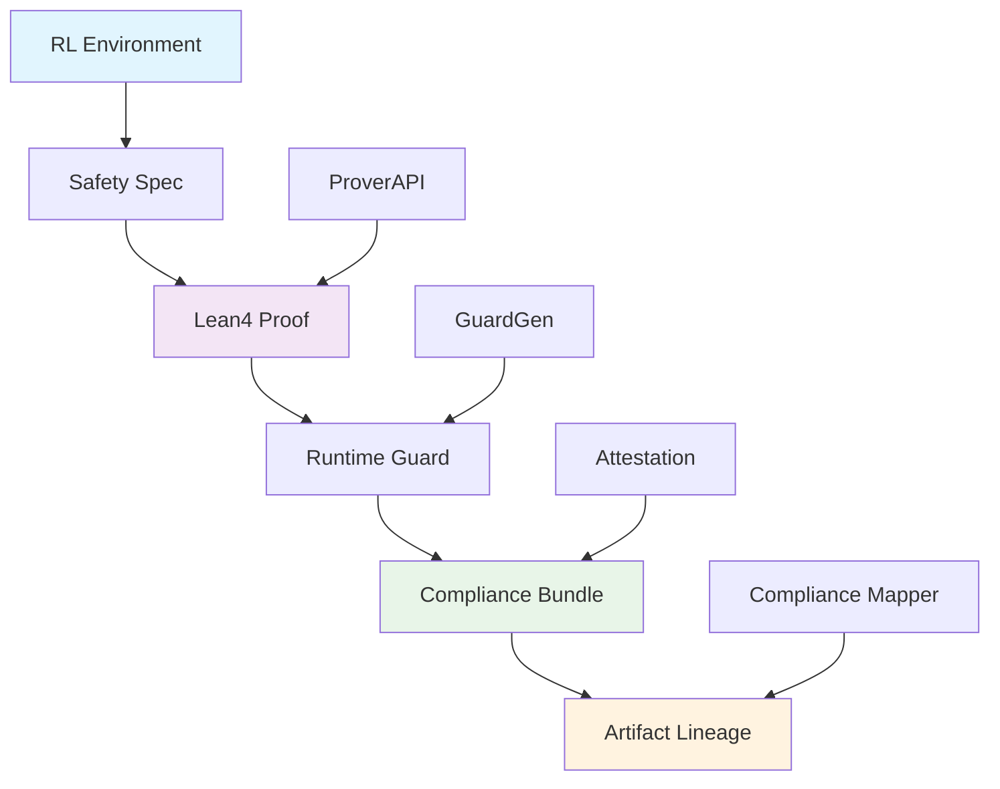

# SafeRL ProofStack Documentation

**RL workflows, Lean artifacts, and compliance bundles**

SafeRL ProofStack combines reinforcement learning with formal verification in Lean4 and produces compliance-oriented artifacts with **traceable inputs and outputs** (specs, proofs, guards, attestation).

## Quick Start

### Install

From [PyPI](https://pypi.org/) when published:

```bash
pip install proofstack
```

From a git checkout (see [repository](https://github.com/fraware/saferl-proof-stack)):

```bash
pip install -e .
```

### CLI workflow

`proofstack bundle` calls the remote prover and requires **`FIREWORKS_API_KEY`** (see [API reference](api_reference.md#environment-variables)).

```bash
export FIREWORKS_API_KEY="your_key"

proofstack init cartpole
proofstack train --algo ppo --timesteps 10000
proofstack bundle --algo ppo
```

### Python API (pipeline)

```python
import json
import os

import gymnasium as gym
from proofstack import ProofPipeline, SpecGen

env = gym.make("CartPole-v1")
spec = SpecGen()
spec.invariants = ["|σ.cart_position| ≤ 2.4", "|σ.pole_angle| ≤ 0.2095"]
spec.guard = ["|σ.cart_position| ≤ 2.3", "|σ.pole_angle| ≤ 0.2"]

api_key = os.environ["FIREWORKS_API_KEY"]
pipeline = ProofPipeline(env, spec, api_key)
bundle = pipeline.run()

with open("attestation_bundle/compliance.json") as f:
    compliance_data = json.load(f)
    print(f"Compliance rate: {compliance_data['summary']['compliance_rate']}%")
```

## What You'll Learn

### [Architecture](architecture.md)

System design, components, and data flow diagrams.

### [API Reference](api_reference.md)

Complete API documentation for all classes, methods, and interfaces.

### [Compliance Mapping](compliance.md)

Structured compliance mapping and artifact lineage in generated reports.

## System Architecture


```mermaid
graph TB
    A[RL Environment] --> B[Safety Spec]
    B --> C[Lean4 Proof]
    C --> D[Runtime Guard]
    D --> E[Compliance Bundle]
    E --> F[Artifact Lineage]

    G[ProverAPI] --> C
    H[GuardGen] --> D
    I[Attestation] --> E
    J[Compliance Mapper] --> F

    style A fill:#e1f5fe
    style C fill:#f3e5f5
    style E fill:#e8f5e8
    style F fill:#fff3e0
```

## Safety Features

### H-0: Stabilization

- **Automated tests** including property-based checks (Hypothesis)
- **Static analysis gates** (ruff, mypy, pre-commit)
- **Pinned toolchain versions** for deterministic builds

### H-1: One-Command UX

- **Zero-config CLI** with sensible defaults
- **Async streaming** for real-time proof updates
- **REST API** for programmatic access

### H-2: Documentation

- **MkDocs** site (this documentation)
- Examples in the repository README and test suite

### H-3: Multi-Algorithm Support

- **Safe SAC & DDPG** implementations
- **Algorithm-specific Lean templates**
- **Parametrized safety specifications**

### H-4: Compliance Mapping & Artifact Lineage

- **IEC 61508 SIL 2**-oriented compliance mapping (see [Compliance](compliance.md))
- **IEC 62443 SL 2**-oriented cybersecurity mapping where applicable
- **Artifact lineage** fields in generated compliance JSON and reports
- **HTML/PDF** attestation outputs where configured

## Use Cases

### Safety-Critical RL

- **Industrial automation** with provable safety bounds
- **Autonomous vehicles** with formal verification
- **Medical robotics** with compliance documentation

### Compliance & Auditing

- **Regulatory submissions** with formal proofs and artifact lineage
- **Safety audits** with comprehensive evidence mapping
- **Risk assessment** with mathematical guarantees and compliance tracking

### Research & Development

- **Safe RL algorithms** with formal verification
- **Novel environments** with safety specifications
- **Proof-of-concept** with compliance bundles

## Compliance Standards

### IEC 61508 SIL 2 - Functional Safety

| Control                        | Status       | Evidence                   |
| ------------------------------ | ------------ | -------------------------- |
| SW-1: Safety Requirements      | ✅ Compliant | Lean4 formal specification |
| SW-7: Software Verification    | ✅ Compliant | Mathematical proofs        |
| SW-8: Configuration Management | ✅ Compliant | SBOM and version control   |

### IEC 62443 SL 2 - Industrial Cybersecurity

| Control                    | Status       | Evidence                |
| -------------------------- | ------------ | ----------------------- |
| SR-3: System Integrity     | ✅ Compliant | Formal integrity proofs |
| SR-10: Security Monitoring | ✅ Compliant | Runtime monitoring      |

## Generated Artifacts

### Core Artifacts

- **Lean4 Proofs** - Formal mathematical verification
- **Runtime Guards** - C code for safety enforcement
- **SBOM** - Software bill of materials

### Compliance Artifacts

- **compliance.json** - Complete artifact lineage mapping
- **attestation.html** - Interactive compliance report
- **attestation.pdf** - Printable regulatory summary
- **Audit Trail** - Complete verification history

## Contributing

See [CONTRIBUTING.md](https://github.com/fraware/saferl-proof-stack/blob/main/CONTRIBUTING.md) in the repository for development setup, checks, and the pull request process.

## Support

- **Issues**: [GitHub Issues](https://github.com/fraware/saferl-proof-stack/issues)
- **Discussions**: [GitHub Discussions](https://github.com/fraware/saferl-proof-stack/discussions)
- **Documentation**: This site

---

**SafeRL ProofStack** — RL workflows with formal artifacts and structured compliance evidence.
